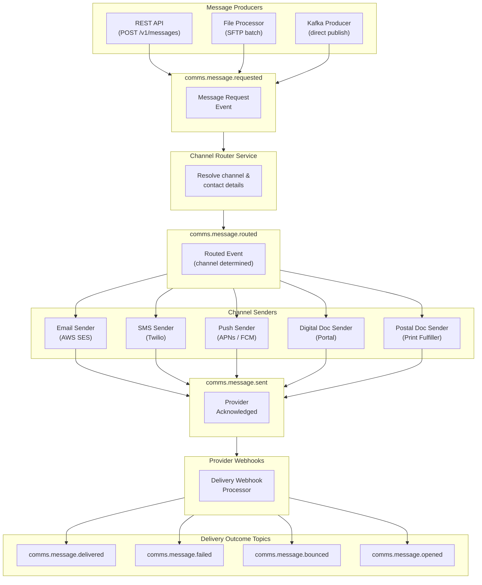

# Topics & Topology

## End-to-end data flow

The diagram below shows how a message flows through the platform — from an API call or batch file, through internal routing and provider dispatch, to final delivery confirmation.

## Topic details

### `comms.message.requested`

**Type:** Inbound / Outbound
**Partitions:** 12
**Retention:** 3 days

Produced when a message request is accepted, regardless of entry point (REST API, file, or direct Kafka produce). This is the canonical "message created" event.

Consumers of this topic can:
- Build audit trails
- Trigger internal workflows (e.g. CRM updates)
- Produce to this topic directly to send messages without using the REST API

**Key:** `messageId`

---

### `comms.message.routed`

**Type:** Outbound
**Partitions:** 12
**Retention:** 7 days

Produced by the Channel Router after resolving the delivery channel for `auto`-routed messages. For messages with an explicit channel, this event is still produced (with `routingReason: "explicit"`).

**Key:** `messageId`

---

### `comms.message.queued`

**Type:** Outbound
**Partitions:** 12
**Retention:** 7 days

Produced when the message has been queued to the downstream provider. This confirms the message left the platform's internal queue.

**Key:** `messageId`

---

### `comms.message.sent`

**Type:** Outbound
**Partitions:** 12
**Retention:** 7 days

Produced when the provider has acknowledged receipt of the message. "Sent" means the provider accepted it — not necessarily that it reached the recipient's inbox/device.

**Key:** `messageId`

---

### `comms.message.delivered`

**Type:** Outbound
**Partitions:** 12
**Retention:** 7 days

Produced when the platform receives a confirmed delivery notification from the provider. Not all channels support delivery confirmation:

| Channel | Delivery confirmation |
|---|---|
| Email | Via provider webhook (not guaranteed — many clients don't send read receipts) |
| SMS | Delivery receipt from carrier |
| Push | APNs/FCM delivery receipt |
| Digital Document | Confirmed when recipient views the document |
| Postal | Estimated — based on expected postal transit time |

**Key:** `messageId`

---

### `comms.message.failed`

**Type:** Outbound
**Partitions:** 12
**Retention:** 7 days

Produced when delivery fails permanently. Includes a `failureCode` and `failureReason` for diagnosis.

**Key:** `messageId`

---

### `comms.message.bounced`

**Type:** Outbound
**Partitions:** 4
**Retention:** 7 days

Email-only. Produced when an email bounces. Distinguishes between:
- **Hard bounce**: Invalid address — the party's email will be automatically suppressed
- **Soft bounce**: Temporary failure (mailbox full, server down) — the platform may retry

**Key:** `messageId`

---

### `comms.message.opened`

**Type:** Outbound
**Partitions:** 4
**Retention:** 7 days

Email-only, requires open tracking to be enabled on the template. Produced when the recipient opens the email. May fire multiple times if the email is opened more than once.

**Key:** `messageId`
